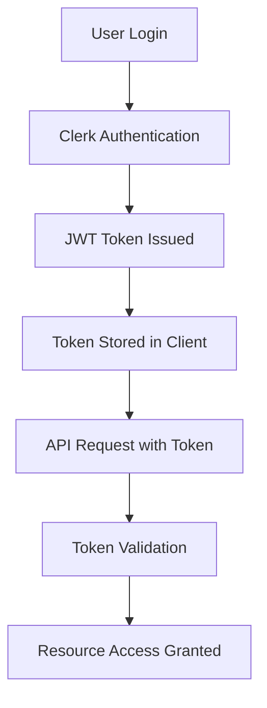

# Authentication

Benee-CMS uses Clerk for authentication, providing secure JWT-based authentication for all API endpoints.

## Authentication Flow

### Overview

<CardGroup cols={2}>
  <Card title="User Authentication" icon="user-check">
    Users authenticate through Clerk's secure authentication system
  </Card>
  <Card title="API Authorization" icon="shield">
    API requests are authorized using JWT tokens from Clerk
  </Card>
</CardGroup>

### Authentication Process



## Getting Authentication Tokens

### Frontend Applications

In React applications, use Clerk's hooks to get authentication tokens:

```typescript
import { useAuth } from '@clerk/nextjs';

function useApiCall() {
  const { getToken } = useAuth();
  
  const callApi = async () => {
    const token = await getToken();
    
    const response = await fetch('/api/documents', {
      headers: {
        'Authorization': `Bearer ${token}`,
        'Content-Type': 'application/json',
      },
    });
    
    return response.json();
  };
  
  return { callApi };
}
```

### Server-Side Authentication

For server-side API calls, use Clerk's server helpers:

```typescript
import { auth } from '@clerk/nextjs';

export async function GET() {
  const { userId, getToken } = auth();
  
  if (!userId) {
    return new Response('Unauthorized', { status: 401 });
  }
  
  const token = await getToken();
  
  // Use token for internal API calls
  const response = await fetch('https://api.benee.com/internal', {
    headers: {
      'Authorization': `Bearer ${token}`,
    },
  });
  
  return response;
}
```

## API Request Headers

### Required Headers

All authenticated API requests must include these headers:

<AccordionGroup>
  <Accordion icon="key" title="Authorization Header">
    ```http
    Authorization: Bearer <jwt_token>
    ```
    
    The JWT token obtained from Clerk authentication.
  </Accordion>
  <Accordion icon="file-type" title="Content Type">
    ```http
    Content-Type: application/json
    ```
    
    Required for requests with JSON payloads.
  </Accordion>
</AccordionGroup>

### Optional Headers

<AccordionGroup>
  <Accordion icon="globe" title="Client Information">
    ```http
    X-Client-Version: 1.0.0
    X-Client-Platform: web
    ```
    
    Helps with debugging and analytics.
  </Accordion>
  <Accordion icon="clock" title="Request ID">
    ```http
    X-Request-ID: unique-request-identifier
    ```
    
    For request tracing and debugging.
  </Accordion>
</AccordionGroup>

## User Roles and Permissions

### Role Hierarchy

<AccordionGroup>
  <Accordion icon="user" title="Standard User">
    **Permissions**:
    - Upload and process documents
    - View own projects and reports
    - Access basic quote tool features
    - Manage personal account settings
  </Accordion>
  <Accordion icon="briefcase" title="Broker">
    **Permissions**:
    - All Standard User permissions
    - Access broker-specific features
    - Manage multiple client accounts
    - Advanced reporting capabilities
    - White-label options
  </Accordion>
  <Accordion icon="users" title="HR Professional">
    **Permissions**:
    - All Standard User permissions
    - Employee benefits management
    - Enrollment workflow access
    - Compliance reporting
    - Plan comparison tools
  </Accordion>
  <Accordion icon="shield" title="Admin">
    **Permissions**:
    - All system permissions
    - User management
    - System configuration
    - Analytics and monitoring
    - API key management
  </Accordion>
</AccordionGroup>

## Token Validation

### Server-Side Validation

API endpoints validate tokens using Clerk's verification:

```typescript
import { verifyToken } from '@clerk/backend';

export async function validateRequest(request: Request) {
  const authHeader = request.headers.get('Authorization');
  
  if (!authHeader?.startsWith('Bearer ')) {
    throw new Error('Missing or invalid authorization header');
  }
  
  const token = authHeader.substring(7);
  
  try {
    const payload = await verifyToken(token, {
      secretKey: process.env.CLERK_SECRET_KEY,
    });
    
    return {
      userId: payload.sub,
      sessionId: payload.sid,
      // Additional claims...
    };
  } catch (error) {
    throw new Error('Invalid or expired token');
  }
}
```

### Token Claims

JWT tokens include these standard claims:

```typescript
interface TokenPayload {
  // Standard JWT claims
  sub: string;      // User ID
  iat: number;      // Issued at
  exp: number;      // Expiration time
  iss: string;      // Issuer
  
  // Clerk-specific claims
  sid: string;      // Session ID
  org_id?: string;  // Organization ID
  org_role?: string; // Organization role
  
  // Custom claims
  user_role: 'user' | 'broker' | 'hr' | 'admin';
  permissions: string[];
}
```

## Error Handling

### Authentication Errors

<AccordionGroup>
  <Accordion icon="x-circle" title="401 Unauthorized">
    **Cause**: Missing or invalid authentication token
    
    **Response**:
    ```json
    {
      "success": false,
      "error": {
        "code": "UNAUTHORIZED",
        "message": "Authentication required"
      }
    }
    ```
    
    **Solution**: Obtain a valid token and retry the request
  </Accordion>
  <Accordion icon="ban" title="403 Forbidden">
    **Cause**: Valid token but insufficient permissions
    
    **Response**:
    ```json
    {
      "success": false,
      "error": {
        "code": "FORBIDDEN",
        "message": "Insufficient permissions for this resource"
      }
    }
    ```
    
    **Solution**: Request access or use an account with appropriate permissions
  </Accordion>
  <Accordion icon="clock" title="419 Token Expired">
    **Cause**: JWT token has expired
    
    **Response**:
    ```json
    {
      "success": false,
      "error": {
        "code": "TOKEN_EXPIRED",
        "message": "Authentication token has expired"
      }
    }
    ```
    
    **Solution**: Refresh the token and retry the request
  </Accordion>
</AccordionGroup>

## Security Best Practices

### Token Handling

<Card title="Security Guidelines" icon="shield-check">
  - **Never log tokens**: Avoid including tokens in logs or error messages
  - **Use HTTPS only**: All API communication must use encrypted connections
  - **Token expiration**: Respect token expiration times and refresh as needed
  - **Secure storage**: Store tokens securely on the client side
</Card>

### Request Security

<AccordionGroup>
  <Accordion icon="lock" title="HTTPS Requirements">
    All API requests must use HTTPS in production:
    - Development: `http://localhost:3002` (allowed)
    - Staging: `https://staging-api.benee.com`
    - Production: `https://api.benee.com`
  </Accordion>
  <Accordion icon="shield" title="Rate Limiting">
    API endpoints implement rate limiting:
    - **Authenticated users**: 1000 requests per hour
    - **Premium users**: 5000 requests per hour
    - **Rate limit headers** included in responses
  </Accordion>
</AccordionGroup>

## API Client Examples

### JavaScript/TypeScript

```typescript
class BeneeApiClient {
  private baseUrl: string;
  private getToken: () => Promise<string>;
  
  constructor(baseUrl: string, getToken: () => Promise<string>) {
    this.baseUrl = baseUrl;
    this.getToken = getToken;
  }
  
  async request<T>(
    endpoint: string, 
    options: RequestInit = {}
  ): Promise<T> {
    const token = await this.getToken();
    
    const response = await fetch(`${this.baseUrl}${endpoint}`, {
      ...options,
      headers: {
        'Authorization': `Bearer ${token}`,
        'Content-Type': 'application/json',
        ...options.headers,
      },
    });
    
    if (!response.ok) {
      const error = await response.json();
      throw new Error(error.error?.message || 'API request failed');
    }
    
    return response.json();
  }
  
  async uploadDocument(file: File, category: string) {
    const formData = new FormData();
    formData.append('file', file);
    formData.append('category', category);
    
    return this.request('/documents/upload', {
      method: 'POST',
      body: formData,
      headers: {}, // Don't set Content-Type for FormData
    });
  }
}
```

### Python

```python
import requests
from typing import Optional, Dict, Any

class BeneeApiClient:
    def __init__(self, base_url: str, get_token_func):
        self.base_url = base_url
        self.get_token = get_token_func
    
    def _headers(self) -> Dict[str, str]:
        token = self.get_token()
        return {
            'Authorization': f'Bearer {token}',
            'Content-Type': 'application/json'
        }
    
    def request(
        self, 
        method: str, 
        endpoint: str, 
        data: Optional[Dict[Any, Any]] = None
    ) -> Dict[Any, Any]:
        url = f"{self.base_url}{endpoint}"
        headers = self._headers()
        
        response = requests.request(
            method=method,
            url=url,
            headers=headers,
            json=data
        )
        
        response.raise_for_status()
        return response.json()
    
    def get_documents(self) -> Dict[Any, Any]:
        return self.request('GET', '/documents')
    
    def upload_document(self, file_path: str, category: str):
        token = self.get_token()
        headers = {'Authorization': f'Bearer {token}'}
        
        with open(file_path, 'rb') as f:
            files = {'file': f}
            data = {'category': category}
            
            response = requests.post(
                f"{self.base_url}/documents/upload",
                headers=headers,
                files=files,
                data=data
            )
            
        response.raise_for_status()
        return response.json()
```

## Webhook Authentication

### Verifying Webhook Signatures

For webhook endpoints, verify the signature to ensure authenticity:

```typescript
import { Webhook } from 'svix';

export async function verifyWebhook(
  payload: string,
  headers: Record<string, string>
) {
  const webhookSecret = process.env.CLERK_WEBHOOK_SECRET;
  
  if (!webhookSecret) {
    throw new Error('Webhook secret not configured');
  }
  
  const wh = new Webhook(webhookSecret);
  
  try {
    const event = wh.verify(payload, headers);
    return event;
  } catch (error) {
    throw new Error('Invalid webhook signature');
  }
}
```

## Troubleshooting

### Common Issues

<AccordionGroup>
  <Accordion icon="bug" title="Token Not Working">
    **Symptoms**: 401 errors despite having a token
    
    **Debugging Steps**:
    1. Check token format (should start with `Bearer `)
    2. Verify token hasn't expired
    3. Ensure correct environment configuration
    4. Check for network issues or proxy problems
  </Accordion>
  <Accordion icon="clock" title="Token Expiration">
    **Symptoms**: 419 errors or authentication suddenly failing
    
    **Solutions**:
    - Implement automatic token refresh
    - Handle token expiration gracefully
    - Check Clerk session configuration
  </Accordion>
  <Accordion icon="network" title="CORS Issues">
    **Symptoms**: Browser blocking API requests
    
    **Solutions**:
    - Verify CORS configuration on API
    - Check allowed origins in environment
    - Use proxy for development if needed
  </Accordion>
</AccordionGroup>

### Debug Tools

- **Clerk Dashboard**: Monitor authentication events
- **Browser DevTools**: Inspect request headers and responses
- **API Logs**: Check server-side authentication logs
- **JWT Debugger**: Use jwt.io to inspect token contents
