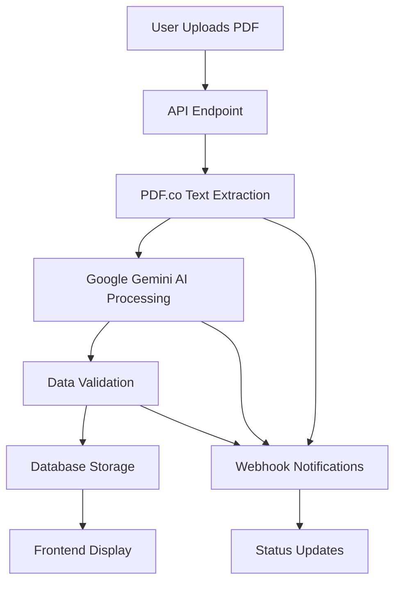
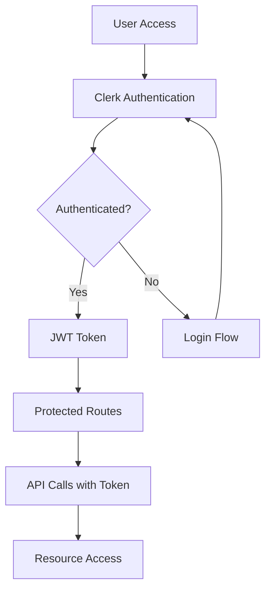

# System Architecture

Benee-CMS is built as a modern, scalable monorepo using TypeScript, React, and Next.js with a focus on modularity and maintainability.

## High-Level Overview

<Card title="Architecture Principles" icon="blueprint">
  - **Monorepo Structure**: All applications and packages in a single repository
  - **Shared Libraries**: Common functionality across multiple applications
  - **Type Safety**: Full TypeScript coverage for reliability
  - **Modern Stack**: Latest React, Next.js, and supporting technologies
</Card>

## Application Architecture

### Frontend Applications

<AccordionGroup>
  <Accordion icon="globe" title="Web App (/apps/web)">
    **Purpose**: Marketing website and landing pages
    
    **Key Features**:
    - Static pages for marketing content
    - Pricing information and plans
    - SEO-optimized content
    - Internationalization support
    
    **Technology Stack**:
    - Next.js App Router
    - Tailwind CSS for styling
    - MDX for content pages
    - React Server Components
  </Accordion>
  <Accordion icon="application" title="Main App (/apps/app)">
    **Purpose**: Core application for benefits analysis
    
    **Key Features**:
    - Authentication with Clerk
    - Quote Tool (Benefits Blueprint)
    - Document processing and analysis
    - User onboarding flow
    - Dashboard and reporting
    
    **Technology Stack**:
    - Next.js with TypeScript
    - Clerk for authentication
    - Tailwind CSS + Design System
    - React Hook Form for forms
    - TanStack Query for state management
  </Accordion>
  <Accordion icon="briefcase" title="Broker Portal (/apps/broker-portal)">
    **Purpose**: Specialized interface for insurance brokers
    
    **Key Features**:
    - Broker-specific workflows
    - Client management
    - Advanced reporting tools
    - Multi-tenant architecture
  </Accordion>
  <Accordion icon="users" title="HR Portal (/apps/hr-portal)">
    **Purpose**: Interface for HR professionals
    
    **Key Features**:
    - Employee benefits management
    - Plan comparison tools
    - Enrollment workflows
    - Communication tools
  </Accordion>
</AccordionGroup>

### Backend Services

<AccordionGroup>
  <Accordion icon="server" title="API (/apps/api)">
    **Purpose**: Core backend services and APIs
    
    **Responsibilities**:
    - Document processing coordination
    - Data validation and storage
    - External service integrations
    - Webhook handling
    
    **Architecture**:
    - RESTful API design
    - Middleware for authentication
    - Error handling and logging
    - Rate limiting and security
  </Accordion>
  <Accordion icon="database" title="Database Layer">
    **Technology**: PostgreSQL with Prisma ORM
    
    **Key Features**:
    - Type-safe database queries
    - Automated migrations
    - Connection pooling
    - Performance optimization
  </Accordion>
</AccordionGroup>

## Shared Packages

### Core Libraries

<AccordionGroup>
  <Accordion icon="palette" title="Design System (/packages/design-system)">
    **Purpose**: Shared UI components and styling
    
    **Components**:
    - Button, Card, Form components
    - Layout and navigation elements
    - Icons and graphics
    - Typography system
    
    **Technologies**:
    - React components with TypeScript
    - Tailwind CSS utilities
    - Radix UI primitives
    - CVA (Class Variance Authority)
  </Accordion>
  <Accordion icon="shield" title="Authentication (/packages/auth)">
    **Purpose**: Shared authentication utilities
    
    **Features**:
    - Clerk integration helpers
    - Type-safe auth context
    - Permission management
    - Session handling
  </Accordion>
  <Accordion icon="globe" title="Internationalization (/packages/internationalization)">
    **Purpose**: Multi-language support
    
    **Features**:
    - Translation dictionaries
    - Locale detection
    - Number and date formatting
    - RTL support preparation
  </Accordion>
</AccordionGroup>

### Utility Packages

<AccordionGroup>
  <Accordion icon="database" title="Database (/packages/database)">
    **Purpose**: Database schemas and utilities
    
    **Contents**:
    - Prisma schema definitions
    - Database connection utilities
    - Migration scripts
    - Seed data for development
  </Accordion>
  <Accordion icon="settings" title="Configuration (/packages/next-config)">
    **Purpose**: Shared Next.js configuration
    
    **Features**:
    - Environment variable validation
    - Build optimization settings
    - Bundle analyzer configuration
    - Security headers
  </Accordion>
</AccordionGroup>

## Data Flow Architecture

### Document Processing Pipeline



### Authentication Flow



## Design Patterns

### Component Architecture

<AccordionGroup>
  <Accordion icon="component" title="Atomic Design">
    **Structure**:
    - **Atoms**: Basic UI elements (Button, Input, Icon)
    - **Molecules**: Simple component combinations (SearchBox, FormField)
    - **Organisms**: Complex UI sections (Header, DataTable, Forms)
    - **Templates**: Page layouts and structure
    - **Pages**: Complete page implementations
  </Accordion>
  <Accordion icon="layer-group" title="Composition Pattern">
    Components are designed for composition:
    
    ```tsx
    <Card>
      <Card.Header>
        <Card.Title>Quote Analysis</Card.Title>
      </Card.Header>
      <Card.Content>
        <DataTable data={quotes} />
      </Card.Content>
    </Card>
    ```
  </Accordion>
</AccordionGroup>

### State Management

<AccordionGroup>
  <Accordion icon="refresh" title="Server State">
    **TanStack Query** for server state management:
    - Caching and synchronization
    - Background updates
    - Error handling
    - Optimistic updates
  </Accordion>
  <Accordion icon="memory" title="Client State">
    **React State** patterns:
    - useState for local component state
    - useContext for shared state
    - useReducer for complex state logic
    - Custom hooks for reusable logic
  </Accordion>
</AccordionGroup>

## API Design

### RESTful Principles

<Card title="API Conventions" icon="link">
  - **Resource-based URLs**: `/api/documents`, `/api/projects`
  - **HTTP Methods**: GET, POST, PUT, DELETE for appropriate actions
  - **Status Codes**: Meaningful HTTP status codes
  - **Consistent Response Format**: Standardized JSON responses
</Card>

### Endpoint Structure

```typescript
// Standard API response format
interface ApiResponse<T> {
  success: boolean;
  data?: T;
  error?: {
    code: string;
    message: string;
    details?: any;
  };
  pagination?: {
    page: number;
    limit: number;
    total: number;
  };
}
```

## Security Architecture

### Authentication & Authorization

<AccordionGroup>
  <Accordion icon="key" title="Authentication">
    **Clerk Integration**:
    - JWT-based authentication
    - Social login providers
    - Multi-factor authentication
    - Session management
  </Accordion>
  <Accordion icon="shield" title="Authorization">
    **Role-based Access Control**:
    - User roles and permissions
    - Resource-level authorization
    - API endpoint protection
    - Frontend route guards
  </Accordion>
</AccordionGroup>

### Data Security

<AccordionGroup>
  <Accordion icon="lock" title="Data Protection">
    - Encryption at rest and in transit
    - Secure environment variable handling
    - Input validation and sanitization
    - SQL injection prevention
  </Accordion>
  <Accordion icon="shield-check" title="API Security">
    - Rate limiting
    - CORS configuration
    - Security headers
    - Request validation
  </Accordion>
</AccordionGroup>

## Performance Optimization

### Frontend Performance

<AccordionGroup>
  <Accordion icon="zap" title="Next.js Optimizations">
    - Server-side rendering (SSR)
    - Static site generation (SSG)
    - Image optimization
    - Code splitting
    - Bundle optimization
  </Accordion>
  <Accordion icon="rocket" title="React Optimizations">
    - Lazy loading components
    - Memoization (React.memo, useMemo)
    - Virtual scrolling for large lists
    - Efficient state updates
  </Accordion>
</AccordionGroup>

### Backend Performance

<AccordionGroup>
  <Accordion icon="database" title="Database Optimization">
    - Query optimization
    - Index strategy
    - Connection pooling
    - Caching layer
  </Accordion>
  <Accordion icon="server" title="API Performance">
    - Response caching
    - Compression middleware
    - Async processing
    - Background jobs
  </Accordion>
</AccordionGroup>

## Deployment Architecture

### Environment Strategy

<Card title="Environment Tiers" icon="layers">
  - **Development**: Local development environment
  - **Staging**: Pre-production testing environment
  - **Production**: Live production environment
</Card>

### Infrastructure

<AccordionGroup>
  <Accordion icon="cloud" title="Hosting">
    **Vercel Platform**:
    - Automatic deployments
    - Edge network distribution
    - Serverless functions
    - Environment management
  </Accordion>
  <Accordion icon="database" title="Database">
    **PostgreSQL**:
    - Managed database service
    - Automated backups
    - Connection pooling
    - Read replicas for scaling
  </Accordion>
</AccordionGroup>

## Monitoring and Observability

### Application Monitoring

<AccordionGroup>
  <Accordion icon="activity" title="Performance Metrics">
    - Page load times
    - API response times
    - Error rates
    - User engagement metrics
  </Accordion>
  <Accordion icon="bug" title="Error Tracking">
    - Client-side error reporting
    - Server-side error logging
    - Stack trace analysis
    - Alert notifications
  </Accordion>
</AccordionGroup>

## Scaling Considerations

### Horizontal Scaling

<Card title="Scaling Strategy" icon="trending-up">
  - **Stateless Design**: Applications designed to scale horizontally
  - **Database Scaling**: Read replicas and sharding strategies
  - **Caching Layer**: Redis for session and data caching
  - **CDN Integration**: Static asset distribution
</Card>

### Performance Monitoring

- Real User Monitoring (RUM)
- Synthetic monitoring
- Performance budgets
- Core Web Vitals tracking

## Future Architecture Goals

### Planned Improvements

<AccordionGroup>
  <Accordion icon="target" title="Short-term Goals">
    - Enhanced caching strategies
    - Improved error handling
    - Better testing coverage
    - Performance optimizations
  </Accordion>
  <Accordion icon="telescope" title="Long-term Vision">
    - Microservices migration path
    - GraphQL API layer
    - Real-time features with WebSockets
    - Advanced analytics integration
  </Accordion>
</AccordionGroup>
